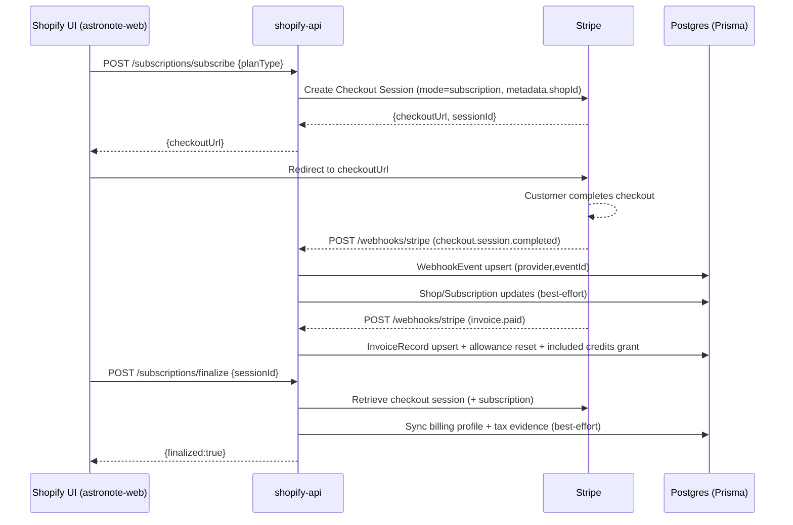
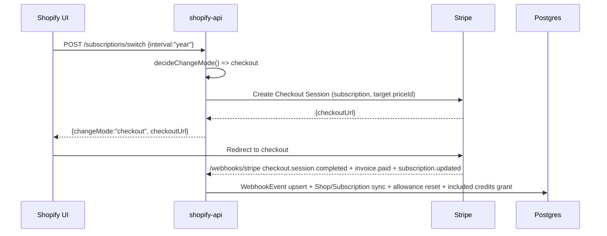
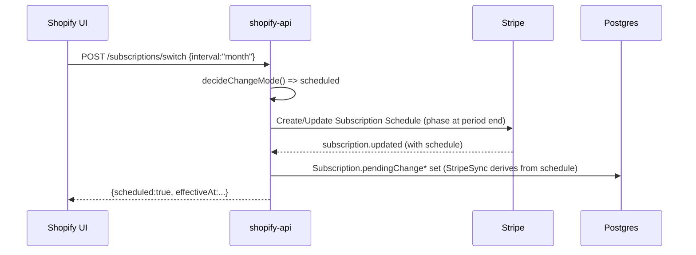
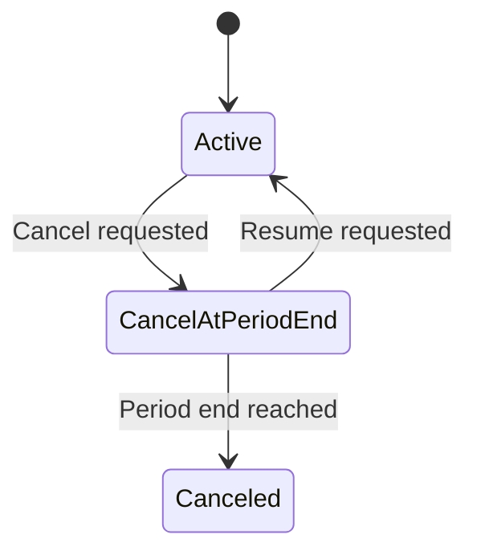
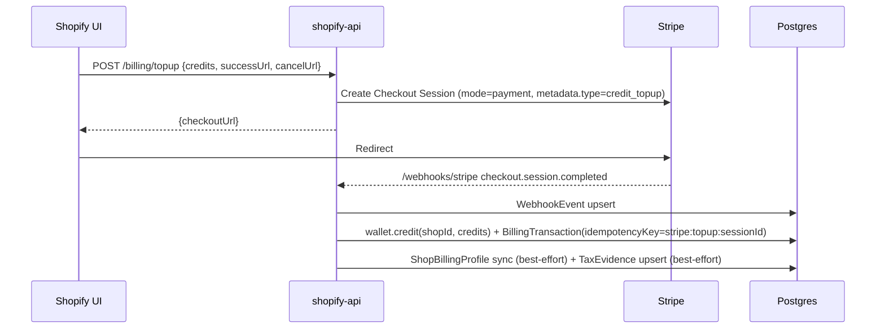

## Shopify Billing Architecture (Astronote)

Scope:
- Backend: `apps/shopify-api` (billing + subscriptions + Stripe webhooks + Stripe sync + plan catalog + wallet/credits + invoices)
- Frontend: `apps/astronote-web` (Shopify billing UI pages + hooks + API client)

**REPORT ONLY** — no runtime behavior changes.  
**NO COMMIT**.

---

## 1) Overview

### Purpose
The Shopify billing system supports:
- **Subscriptions** (Starter/Pro) via Stripe Checkout and Stripe Subscriptions.
- **Credits** used for SMS sending:
  - **Included allowance per billing period** (free SMS credits granted each cycle).
  - **Wallet credits** (purchased as one-off credit packs or variable top-ups).
- **Invoices + purchase history** surfaced in the UI (DB-first with Stripe fallback/backfill).

### Tenancy model (shopId)
- The tenant key everywhere is **`shopId`** (a `Shop.id` in Prisma).
- Tenant context for authenticated API calls is resolved by middleware (`getStoreId(req)` from `middlewares/store-resolution.js`) and stored on `req.ctx.store`.
- For Stripe webhooks, tenant resolution follows a best-effort chain:
  1) `event.data.object.metadata.shopId` (or `storeId`)
  2) `customerId` → `Shop.stripeCustomerId`
  3) `subscriptionId` → `Shop.stripeSubscriptionId`, then `Subscription.stripeSubscriptionId`
  4) If still unresolved: event is recorded as **unmatched** and acknowledged with 200.

### “Source of truth” philosophy (Stripe vs DB)
- **Stripe is authoritative** for subscription state, price/interval, billing period dates, and invoices.
- The DB is a **cache + operational mirror** for:
  - fast reads (`Shop.planType`, `Shop.subscriptionStatus`, `Shop.currentPeriodEnd`, etc.)
  - internal business logic (allowance tracking, credits wallet balance, purchase ledger)
  - replay protection and idempotency (`WebhookEvent`, unique keys)
- The **StripeSyncService** (`services/stripe-sync.js`) implements “absolute Stripe↔DB transparency”:
  - reads may fetch Stripe and update DB if drift is detected
  - the UI can request “Refresh from Stripe” which triggers reconciliation.

---

## 2) Data models (Prisma)

Billing-related Prisma models live in `apps/shopify-api/prisma/schema.prisma`.

### `Shop`
Represents a Shopify tenant and stores subscription/allowance fields used by the billing + send pipeline.

Key columns:
- **Identity**: `id`, `shopDomain` (unique)
- **Stripe linkage**: `stripeCustomerId` (unique), `stripeSubscriptionId` (unique)
- **Subscription mirror**: `planType`, `subscriptionStatus`, `subscriptionInterval`, `currentPeriodStart`, `currentPeriodEnd`, `cancelAtPeriodEnd`, `lastBillingError`
- **Allowance tracking**: `includedSmsPerPeriod`, `usedSmsThisPeriod`, `lastPeriodResetAt`
- **Currency**: `currency`

Uniqueness / idempotency:
- `shopDomain` unique
- `stripeCustomerId` unique
- `stripeSubscriptionId` unique

### `Subscription`
Canonical subscription mirror with additional reconciliation and pending-change tracking.

Key columns:
- `shopId` (unique)
- Stripe linkage: `stripeCustomerId`, `stripeSubscriptionId` (unique)
- Canonical sku: `planCode`, `interval`, `currency`
- State: `status`, `cancelAtPeriodEnd`, period dates
- Pending scheduled changes:
  - `pendingChangePlanCode`, `pendingChangeInterval`, `pendingChangeCurrency`, `pendingChangeEffectiveAt`
- Reconciliation metadata: `lastSyncedAt`, `sourceOfTruth`

Uniqueness:
- `shopId` unique
- `stripeSubscriptionId` unique

### `ShopBillingProfile`
Billing identity and VAT data (synced from Stripe Checkout/Customer/Invoice and editable in-app).

Key columns:
- `shopId` (unique)
- `legalName`, `billingEmail`
- `billingAddress` (JSON)
- VAT: `vatNumber`, `vatCountry`, `taxStatus`, `taxExempt`
- Extra: `isBusiness`, `vatValidated`, `validatedAt`, `validationSource`, `taxTreatment`

Uniqueness:
- `shopId` unique

### `Wallet`
The wallet credit balance used for pay-as-you-go credits.

Key columns:
- `shopId` (unique), `balance`
- totals: `totalUsed`, `totalBought`

Uniqueness:
- `shopId` unique

### `CreditTransaction`
Immutable ledger of credit debits/credits applied to the wallet.

Key columns:
- `shopId`, `type`, `amount`, `balanceAfter`
- linkage: `campaignId`, `messageId`
- **idempotency**: `idempotencyKey` (nullable)

Uniqueness / idempotency:
- `@@unique([shopId, idempotencyKey])` (prevents double credit/debit when caller supplies a stable key)

### `BillingTransaction`
Purchase-history/ledger entry representing money→credits events (subscription payments, top-ups, included credits grants).

Key columns:
- `shopId`, `creditsAdded`, `amount` (cents), `currency`, `packageType`, `status`
- Stripe linkage: `stripeSessionId` (invoiceId or checkout session id), `stripePaymentId`
- **idempotency**: `idempotencyKey` (nullable)

Uniqueness / idempotency:
- `@@unique([shopId, idempotencyKey])`

### `InvoiceRecord`
DB mirror of Stripe invoices used for fast listing and linking users to hosted invoice URLs.

Key columns:
- `shopId`
- `stripeInvoiceId` (unique)
- URLs: `hostedInvoiceUrl`, `pdfUrl`
- totals: `subtotal`, `tax`, `total`, `currency`
- `status`, `issuedAt`
- Optional relation: `taxEvidence`

Uniqueness:
- `stripeInvoiceId` unique

### `WebhookEvent`
Webhook replay protection and audit log for Stripe/Shopify/Mitto.

Key columns:
- `provider` (`stripe|shopify|mitto`), `eventId`
- `eventHash` / `payloadHash`
- `eventType`
- `shopId` (nullable for unmatched)
- timestamps: `receivedAt`, `processedAt`
- `status` (`received|processed|failed|duplicate|unmatched`)
- `payload` (JSON), `error`

Uniqueness / idempotency:
- `@@unique([provider, eventId])`

---

## 3) Plan catalog & pricing configuration

### Supported subscription SKUs
The user-selectable subscription targets are intentionally constrained (Retail-aligned, “2 SKU mode”):
- **Starter / Monthly**
- **Pro / Yearly**

Internally, the plan catalog supports:
- **Retail-simple mode** (legacy, 4 env vars): planCode × currency with implied interval
- **Matrix mode** (8 env vars): planCode × interval × currency

### Price-id environment variables
**Retail-simple (implied intervals)**:
- `STRIPE_PRICE_ID_SUB_STARTER_EUR`
- `STRIPE_PRICE_ID_SUB_STARTER_USD`
- `STRIPE_PRICE_ID_SUB_PRO_EUR`
- `STRIPE_PRICE_ID_SUB_PRO_USD`

**Matrix (explicit intervals)**:
- `STRIPE_PRICE_ID_SUB_STARTER_MONTH_EUR`, `STRIPE_PRICE_ID_SUB_STARTER_MONTH_USD`
- `STRIPE_PRICE_ID_SUB_STARTER_YEAR_EUR`, `STRIPE_PRICE_ID_SUB_STARTER_YEAR_USD`
- `STRIPE_PRICE_ID_SUB_PRO_MONTH_EUR`, `STRIPE_PRICE_ID_SUB_PRO_MONTH_USD`
- `STRIPE_PRICE_ID_SUB_PRO_YEAR_EUR`, `STRIPE_PRICE_ID_SUB_PRO_YEAR_USD`

### Startup validation
At startup, `config/env-validation.js` calls `services/plan-catalog.js`:
- Logs detected catalog mode and supported SKUs.
- In **production** (or CI), missing required vars causes a hard failure (fail-fast).

### Reverse lookup: Stripe `priceId` → `{planType, interval, currency}`
Implemented in `services/plan-catalog.js` as `resolvePlanFromPriceId(priceId)`:
- Scans configured env vars and maps back to `{ planCode, interval, currency }`.
- Supports legacy mapping with implied intervals (starter→month, pro→year) and logs a warning.

This reverse lookup is used by:
- `services/stripe-sync.js` (canonical subscription derivation)
- webhook handlers (subscription updates, invoice paid processing)
- backfill scripts (`scripts/backfill-billing-from-stripe.js`)

---

## 4) Backend route surface (API contract)

All endpoints below are scoped to the current `shopId` via `getStoreId(req)` (except Stripe webhooks).

### Subscriptions (`/subscriptions/*`)

#### `GET /subscriptions/status`
- **Purpose**: Return subscription status DTO (Stripe-synced) + server-computed action matrix.
- **Response**: subscription DTO including `allowedActions` and `availableOptions`.
- **Implementation**: `controllers/subscriptions.js#getStatus` → `services/stripe-sync.js#getSubscriptionStatusWithStripeSync`, `services/subscription-actions.js`.
- **Errors**: Stripe not configured (503 in some paths), tenant not found, validation drift.

#### `POST /subscriptions/subscribe`
- **Purpose**: Start a new subscription via Stripe Checkout.
- **Request**: `{ planType: 'starter' | 'pro' }` (interval/currency derived).
- **Response**: `{ checkoutUrl }`.
- **Implementation**: `controllers/subscriptions.js#subscribe` → `services/stripe.js#createSubscriptionCheckoutSession`.
- **Notable validation**:
  - Validates SKU is supported (`plan-catalog` + env vars).
  - Validates `FRONTEND_URL` produces valid absolute redirect URLs.

#### `POST /subscriptions/finalize`
- **Purpose**: Finalize subscription after checkout success redirect by reading the Checkout Session.
- **Request**: `{ sessionId: string, type?: string }`
- **Response**: `{ finalized: true, subscription: ... }` (and/or status details).
- **Implementation**: `controllers/subscriptions.js#finalize` → `services/stripe.js#getCheckoutSession` + subscription services; best-effort billing profile sync and tax evidence creation.

#### `POST /subscriptions/update`
- **Purpose**: Change plan (Billing v2 alignment). May schedule or require checkout depending on policy.
- **Request**: `{ planType: 'starter' | 'pro' }`
- **Response**:
  - Either immediate/scheduled change details, or
  - `{ changeMode: 'checkout', checkoutUrl }` when payment is required.
- **Implementation**: `controllers/subscriptions.js#update` and `#switchInterval` delegate to `services/subscription-change-policy.js` and Stripe checkout when needed.

#### `POST /subscriptions/switch`
- **Purpose**: Shortcut to switch interval (in practice toggles between the 2 SKUs).
- **Request**: `{ interval?: 'month'|'year', planType?: 'starter'|'pro' }` (one required).
- **Response**:
  - If upgrade/pay-now: `{ changeMode:'checkout', checkoutUrl }`
  - If downgrade: scheduled change details.
- **Implementation**: `controllers/subscriptions.js#switchInterval`

#### `POST /subscriptions/scheduled/change`
- **Purpose**: Change an existing scheduled downgrade.
- **Request**: `{ planType: 'starter'|'pro' }`
- **Implementation**: `controllers/subscriptions.js#changeScheduled`

#### `POST /subscriptions/scheduled/cancel`
- **Purpose**: Cancel a scheduled downgrade.
- **Implementation**: `controllers/subscriptions.js#cancelScheduled`

#### `POST /subscriptions/cancel`
- **Purpose**: Cancel at period end (default) or immediate in some paths.
- **Implementation**: `controllers/subscriptions.js#cancel` → `services/stripe.js#cancelSubscription`

#### `POST /subscriptions/resume`
- **Purpose**: Resume a subscription that was set to cancel at period end.
- **Implementation**: `controllers/subscriptions.js#resume` → `services/stripe.js#resumeSubscription`

#### `GET /subscriptions/portal`
- **Purpose**: Open Stripe customer portal.
- **Response**: `{ portalUrl }`
- **Implementation**: `controllers/subscriptions.js#getPortal` → `services/stripe.js#getCustomerPortalUrl`
- **Notes**: return URL includes `fromPortal=true` to trigger sync on the billing page.

#### `POST /subscriptions/reconcile`
- **Purpose**: Manual “refresh from Stripe” reconciliation.
- **Implementation**: `controllers/subscriptions.js#reconcile` → `services/stripe-sync.js#getSubscriptionStatusWithStripeSync`

#### `POST /subscriptions/verify-session`
- **Purpose**: Manual verification of a checkout session (support/debug).
- **Request**: `{ sessionId }`

### Billing (`/billing/*`)

#### `GET /billing/balance`
- **Purpose**: Return wallet balance (+ subscription info).
- **Implementation**: `controllers/billing.js#getBalance` → `services/billing.js#getBalance` (wallet-backed).

#### `GET /billing/summary`
- **Purpose**: Combined subscription + allowance + wallet balance.
- **Implementation**: `controllers/billing.js#getSummary` → `services/subscription.js#getBillingSummary`
- **Composition**:
  - subscription: Stripe-synced (`stripe-sync`)
  - allowance: from subscription DTO fields
  - wallet credits: from `wallet.getBalance`

#### `GET /billing/profile`
- **Purpose**: Return current billing profile.
- **Implementation**: `controllers/billing.js#getProfile` → `services/billing-profile.js#getBillingProfile`

#### `PUT /billing/profile`
- **Purpose**: Update billing profile in DB and sync Stripe Customer.
- **Request**: see `schemas/billing.schema.js#billingProfileSchema`
- **Implementation**: `controllers/billing.js#updateProfile` → `upsertBillingProfile` + `ensureStripeCustomer` + `syncStripeCustomerBillingProfile`

#### `POST /billing/profile/sync-from-stripe`
- **Purpose**: Pull billing identity from Stripe Customer into DB (and optionally re-sync back).
- **Implementation**: `controllers/billing.js#syncProfileFromStripe`

#### `GET /billing/packages`
- **Purpose**: List credit-pack packages (requires active subscription).
- **Implementation**: `controllers/billing.js#getPackages` → `services/billing.js#getPackages`

#### `POST /billing/purchase`
- **Purpose**: Create Stripe Checkout session for a credit pack (requires active subscription).
- **Request**: `{ packageId, successUrl, cancelUrl, currency? }`
- **Idempotency**: requires `Idempotency-Key` header; DB also uses `Purchase.shopId + Purchase.idempotencyKey`.
- **Implementation**: `controllers/billing.js#createPurchase` → `services/billing.js#createPurchaseSession` → `services/stripe.js#createStripeCheckoutSession`

#### `GET /billing/topup/calculate`
- **Purpose**: Quote a variable top-up price (VAT/tax-aware).
- **Request**: query `{ credits, currency? }`
- **Implementation**: `controllers/billing.js#calculateTopup` → `services/subscription.js#calculateTopupPrice`

#### `POST /billing/topup`
- **Purpose**: Create Stripe Checkout session for a variable top-up.
- **Request**: `{ credits, successUrl, cancelUrl, currency? }`
- **Implementation**: `controllers/billing.js#createTopup` → `services/stripe.js#createCreditTopupCheckoutSession`

#### `GET /billing/invoices`
- **Purpose**: List invoices (DB-first; Stripe fallback if DB empty).
- **Implementation**: `controllers/billing.js#getInvoices` → `services/invoices.js#listInvoices`

#### `GET /billing/history`
- **Purpose**: Wallet transaction history (internal ledger, `WalletTransaction`).
- **Implementation**: `controllers/billing.js#getHistory` → `services/billing.js#getTransactionHistory`

#### `GET /billing/billing-history`
- **Purpose**: Purchase history ledger (money events) from `BillingTransaction`.
- **Implementation**: `controllers/billing.js#getBillingHistory` → `services/billing.js#getBillingHistory`

### Stripe webhooks

#### `POST /webhooks/stripe`
- **Purpose**: Process Stripe events with signature verification + replay protection.
- **Implementation**: `routes/stripe-webhooks.js` → `controllers/stripe-webhooks.js#handleStripeWebhook`

---

## 5) Supported flows (sequence diagrams + explanation)

Notes:
- Each flow shows the **Stripe objects touched**, and the **DB writes** with idempotency rules.
- Some paths have both a “finalize” step (frontend-driven) and webhook processing (Stripe-driven). The design goal is eventual consistency and safe retries.

### A) Subscribe (new subscription) → Checkout → success redirect → finalize → webhook events

**Narrative**
1. User clicks Subscribe in UI.
2. FE calls `POST /subscriptions/subscribe` with `planType`.
3. Backend validates SKU + builds success/cancel URLs using `FRONTEND_URL`.
4. Backend creates Stripe Checkout Session (mode `subscription`), returns `checkoutUrl`.
5. User completes Stripe Checkout.
6. Stripe sends `checkout.session.completed` and later `invoice.paid` and `customer.subscription.updated`.
7. FE success page calls `POST /subscriptions/finalize` with `session_id`.
8. Final state is reconciled via StripeSync + webhook events update DB.

**Stripe objects**
- Checkout Session (subscription mode)
- Subscription
- Invoice (+ PaymentIntent)

**DB writes**
- `Shop` updated with `stripeCustomerId`, `stripeSubscriptionId`, `planType`, `subscriptionStatus`, period dates, etc. (via webhook + StripeSync)
- `Subscription` upserted with canonical fields + pendingChange (via StripeSync)
- `ShopBillingProfile` synced from checkout session (best-effort)
- `InvoiceRecord` upserted on `invoice.paid`
- `WebhookEvent` recorded for replay protection
- Included credits / allowance: on `invoice.paid` for subscription invoices

### B) Switch plan / interval

This system uses a policy-based approach (`services/subscription-change-policy.js`):
- **Month → Year (upgrade)**: `changeMode = checkout` (requires payment)
- **Year → Month (downgrade)**: `changeMode = scheduled` (takes effect at period end)

#### B1) Month → Year (requires payment)

**Narrative**
1. User requests switch (Starter/Monthly → Pro/Yearly).
2. FE calls `POST /subscriptions/switch` (or `POST /subscriptions/update`).
3. Backend decides `checkout` mode and returns a Checkout URL via `createSubscriptionChangeCheckoutSession`.
4. User completes checkout → Stripe webhooks update subscription, and StripeSync reconciles.

**Stripe objects**
- Checkout Session (subscription mode)
- Subscription (new), and previous subscription id referenced in metadata
- Invoice/PaymentIntent

#### B2) Year → Month or downgrade (scheduled at period end)

**Narrative**
1. User requests downgrade.
2. Backend decides `scheduled` mode.
3. Stripe schedule is created/updated; DB stores pending change in `Subscription.pendingChange*`.
4. UI shows pending change and allows cancel/change.

**Stripe objects**
- Subscription Schedule (or subscription update w/ schedule)

#### B3) Cancel scheduled change
1. FE calls `POST /subscriptions/scheduled/cancel`.
2. Backend removes/cancels schedule in Stripe.
3. StripeSync clears `pendingChange*` in DB.

### C) Cancel subscription & resume subscription

Cancel (default: at period end):
- FE calls `POST /subscriptions/cancel`
- Backend calls Stripe subscription update (`cancel_at_period_end=true`)
- UI continues to show active until end date; allowed action becomes “resume”.

Resume:
- FE calls `POST /subscriptions/resume`
- Backend calls Stripe subscription update (`cancel_at_period_end=false`)
- StripeSync updates DB.

### D) Billing profile (create/update/sync-from-stripe) and VAT fields

Paths:
- **DB → Stripe**: `PUT /billing/profile` upserts DB, ensures a Stripe customer, then updates Stripe customer fields and tax IDs.
- **Stripe → DB**:
  - `POST /billing/profile/sync-from-stripe`
  - `POST /subscriptions/finalize` (from checkout session)
  - Stripe webhooks: `invoice.paid` and `checkout.session.completed` (best-effort sync)

VAT behavior:
- VAT numbers are normalized (strip spaces, uppercase).
- Stripe tax ID sync is idempotent (checks existing tax IDs; removes old ones).

### E) Included credits per period (grant on invoice.paid) and allowance resets

Trigger events (webhooks):
- `invoice.paid` / `invoice.payment_succeeded` for subscription invoices.

Behavior:
- `resetAllowanceForNewPeriod(shopId, stripeSubscription)` resets `usedSmsThisPeriod` and updates `includedSmsPerPeriod`, period dates (idempotent by comparing period start).
- `allocateFreeCredits(shopId, planType, idempotencyRef, ...)` grants included credits idempotently.
- A matching `BillingTransaction` is recorded for the included credits grant (`recordFreeCreditsGrant`) with an idempotency key derived from invoice/subscription.

### F) Credit top-up / one-off purchase → Checkout → webhook → wallet credit

Two purchase types exist:
- **Credit packs** (`POST /billing/purchase`): uses `Purchase` records and `services/billing.js#handleStripeWebhook`.
- **Variable top-up** (`POST /billing/topup`): handled by `controllers/stripe-webhooks.js` `handleCheckoutSessionCompletedForTopup`.

Both:
- Credit the wallet via `wallet.credit(...)`
- Record a `BillingTransaction` with a stable idempotency key (`stripe:topup:${session.id}` or `stripe:invoice:${invoice.id}` etc.)
- Sync billing profile + tax evidence when available.

### G) Invoices list + backfill strategy

Primary behavior:
- `GET /billing/invoices` reads `InvoiceRecord` (DB-first).

Fallback:
- If DB has **0 invoices**, `services/invoices.js#listInvoices` attempts to fetch recent invoices from Stripe (using `stripeCustomerId`, and may resolve it from `stripeSubscriptionId`), then upserts to DB and re-reads.

Where user sees them:
- Shopify billing UI page (`apps/astronote-web/app/app/shopify/billing/page.tsx`) shows invoices list with pagination and invoice links.

### H) Purchase history / ledger (BillingTransaction) and relationship to invoices

- `GET /billing/billing-history` returns transformed `BillingTransaction` rows.
- For subscription charges, it tries to find a matching `InvoiceRecord` by `stripeInvoiceId == BillingTransaction.stripeSessionId` and exposes `hostedInvoiceUrl` as `linkUrl`.
- For included credits, it records a `BillingTransaction` with `amount=0` and packageType `subscription_included_*`.

---

## 6) Stripe webhooks & idempotency

### Events handled
In `controllers/stripe-webhooks.js` (switch statement):
- `checkout.session.completed`
- `checkout.session.expired`
- `payment_intent.succeeded`
- `payment_intent.payment_failed`
- `invoice.payment_succeeded` / `invoice.paid`
- `invoice.payment_failed`
- `customer.subscription.updated`
- `customer.subscription.deleted`
- `charge.refunded` / `payment_intent.refunded`

### Replay protection strategy
- Implemented by `services/webhook-replay.js`.
- The event is uniquely identified by `provider + eventId` stored in `WebhookEvent` (`@@unique([provider,eventId])`).
- For extra safety, `eventHash` / `payloadHash` (SHA256) can detect duplicates when IDs are not stable.
- Webhook handler returns **200 OK even for duplicates** to prevent Stripe retries.

### Tenant resolution rules for webhooks
`controllers/stripe-webhooks.js#resolveShopIdFromStripeEvent`:
1) `metadata.shopId` / `metadata.storeId`
2) `customer` → `Shop.stripeCustomerId`
3) `subscription` → `Shop.stripeSubscriptionId` or `Subscription.stripeSubscriptionId`
4) Unmatched: recorded and acknowledged (no processing)

### “Unmatched event” behavior and logging
- Records an unmatched `WebhookEvent` (status `unmatched`) if not already present.
- Logs a warning with `resolutionMethod` and returns success `{ unmatched: true }`.

---

## 7) StripeSyncService & transparency guarantees

### When sync is triggered
- **Read-time reconciliation**: `GET /subscriptions/status` calls `getSubscriptionStatusWithStripeSync(shopId)`.
- **Manual reconciliation**: `POST /subscriptions/reconcile`.
- Implicitly after some mutations (the UI also has “Refresh status” action).

### What mismatches it resolves
- If Stripe differs from DB on any of:
  - planCode/interval/currency (via `resolvePlanFromPriceId`)
  - subscription status
  - billing period start/end
  - cancelAtPeriodEnd
  - pending scheduled changes (derived from Stripe schedule phases)
- It updates:
  - `Shop` canonical subscription fields
  - `Subscription` canonical fields and pendingChange fields

### What it does NOT do
- It does not retroactively rebuild the entire purchase ledger.
- It does not “invent” invoices; invoice backfill is a separate concern (`services/invoices.js#listInvoices` fallback and `scripts/backfill-billing-from-stripe.js`).
- It does not debit/credit wallet balances; those are driven by explicit purchase flows and send-credit logic.

### UI transparency implications
- The API response includes metadata fields like `sourceOfTruth`, `mismatchDetected`, and `lastSyncedAt`.
- UI actions include “Refresh Status” / “Reconcile” to force a Stripe-verified view when needed.

---

## 8) Frontend billing UX wiring

### Entry pages
- Main page: `apps/astronote-web/app/app/shopify/billing/page.tsx`
- Redirect pages:
  - `apps/astronote-web/app/app/shopify/billing/success/page.tsx`
  - `apps/astronote-web/app/app/shopify/billing/cancel/page.tsx`
  - (additional settings under `billing/settings` exist in routes)

### Key hooks
Located under `apps/astronote-web/src/features/shopify/billing/hooks/*`:
- Queries:
  - `useSubscriptionStatus`
  - `useBillingSummary`
  - `useBillingBalance`
  - `useBillingInvoices`
  - `useBillingHistory`
  - `useBillingProfile`
  - `useBillingPackages`
  - `useCalculateTopup`
- Mutations:
  - `useSubscribe`, `useUpdateSubscription`, `useSwitchInterval`, `useCancelSubscription`, `useResumeSubscription`
  - `useGetPortal`, `useReconcileSubscription`
  - `useFinalizeSubscription`
  - `useCreatePurchase`, `useCreateTopup`
  - `useSyncBillingProfileFromStripe`

### API client
`apps/astronote-web/src/lib/shopifyBillingApi.ts`
- Defines DTOs and calls the backend via an axios client.
- Normalizes errors into a consistent `BillingApiError`.

### How FE decides actions to show
Action rendering is based on the **billing action matrix**:
- File: `src/features/shopify/billing/utils/billingActionMatrix.ts`
- The UI derives a canonical `BillingUIState` from `/subscriptions/status`.
- `getAvailableActions(uiState, backendAllowedActions)`:
  - Prefers server-provided `allowedActions` to prevent drift.
  - Falls back to local computation.

### Query invalidation map (mutation → query keys)

Canonical keys are in `src/features/shopify/queryKeys.ts` under:
- `shopifyQueryKeys.subscriptions.status()`
- `shopifyQueryKeys.billing.summary()`
- `shopifyQueryKeys.billing.balance()`
- `shopifyQueryKeys.billing.invoicesRoot()` / `.invoices(params)`
- `shopifyQueryKeys.billing.historyRoot()` / `.history(params)`
- `shopifyQueryKeys.billing.profile()`

Mutations invalidate:
- **Update/Switch interval/Reconcile/Finalize** (subscriptions):
  - subscriptions.status
  - billing.summary
  - billing.balance
  - billing.invoicesRoot
  - billing.historyRoot
- **CreatePurchase/CreateTopup**:
  - billing.balance
  - billing.summary
  - billing.invoicesRoot
  - billing.historyRoot
- **SyncBillingProfileFromStripe**:
  - billing.profile
  - billing.summary

---

## 9) Operational notes

### Required env vars checklist (minimum)

Stripe:
- `STRIPE_SECRET_KEY`
- `STRIPE_WEBHOOK_SECRET`

Frontend redirects:
- `FRONTEND_URL` (or `FRONTEND_BASE_URL`) must be a valid absolute URL (https recommended)

Plan catalog price IDs (choose one mode):
- Retail-simple (4 vars) OR Matrix (8 vars) — see Section 3.

Optional/related:
- `STRIPE_TAX_ENABLED=true|false`
- `CREDIT_PRICE_EUR`, `CREDIT_PRICE_USD` (top-up pricing)

### Common failure modes & diagnosis
- **Missing price IDs**:
  - Symptom: subscribe/switch endpoints return “unsupported plan interval” or startup fails in production.
  - Fix: configure plan-catalog env vars; check logs for “Missing required Stripe price env vars…”.
- **Webhook signature invalid**:
  - Symptom: Stripe retries events; system never updates subscription/credits.
  - Fix: ensure `STRIPE_WEBHOOK_SECRET` matches the configured endpoint; confirm raw body capture is enabled.
- **Unmatched webhook events**:
  - Symptom: logs show “Stripe webhook unmatched (no shop resolved)”.
  - Fix: ensure Checkout Session metadata includes `shopId`; ensure customerId/subscriptionId links exist in DB.
- **DB out of sync with Stripe**:
  - Symptom: UI shows wrong status/plan.
  - Fix: run “Refresh Status” (calls `/subscriptions/reconcile`) and confirm StripeSync updates.
- **Invoices missing in UI**:
  - Symptom: invoices list empty.
  - Fix: invoice fallback requires `stripeCustomerId`; it may be resolved from `stripeSubscriptionId`. For bulk backfill use `scripts/backfill-billing-from-stripe.js`.

### Production readiness checklist (manual tests)
- **Subscribe**:
  - subscribe → Checkout → success → billing shows Active plan, period dates, invoices show latest invoice link
- **Upgrade** (month→year):
  - requires checkout; after completion, DB reflects pro/year and no duplicate subscriptions created
- **Downgrade** (year→month):
  - scheduled change appears, can cancel/change scheduled change
- **Cancel/resume**:
  - cancel at period end toggles `cancelAtPeriodEnd`; resume clears it
- **Top-up**:
  - top-up credits → wallet balance increases once; billing history records purchase once
- **Credit pack purchase**:
  - purchase requires subscription; idempotency key prevents duplicate sessions
- **Webhooks**:
  - replay protection: repeated event IDs do not double-apply credits or state

