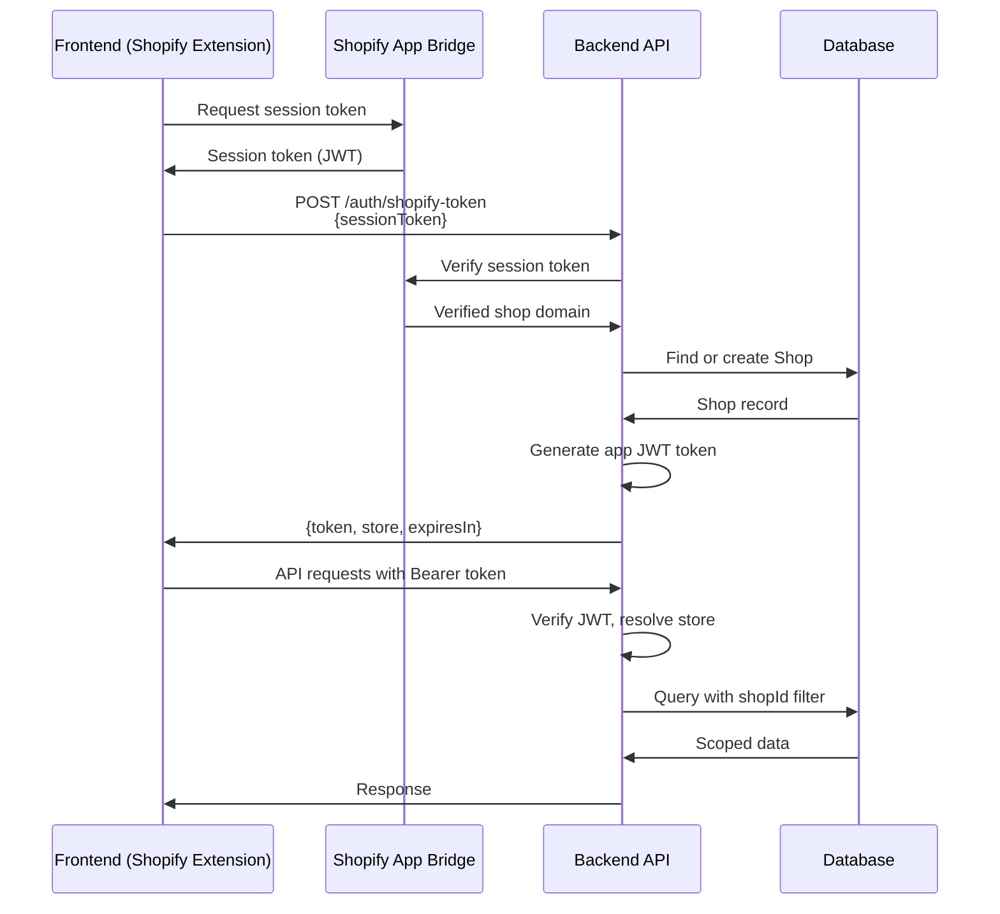
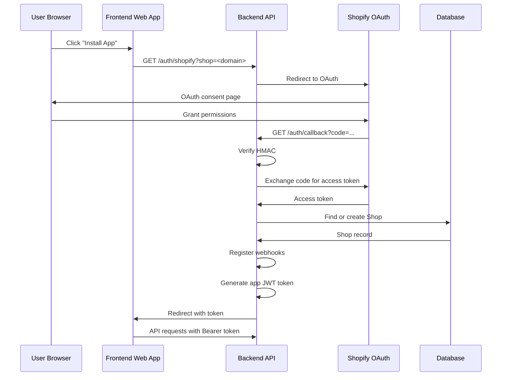
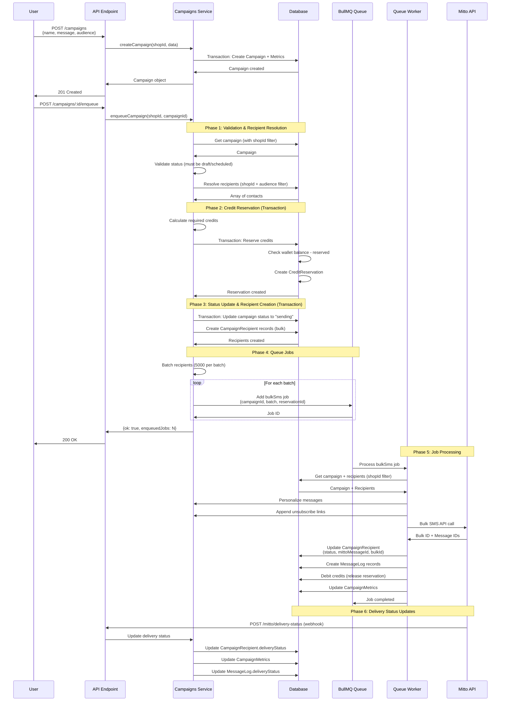
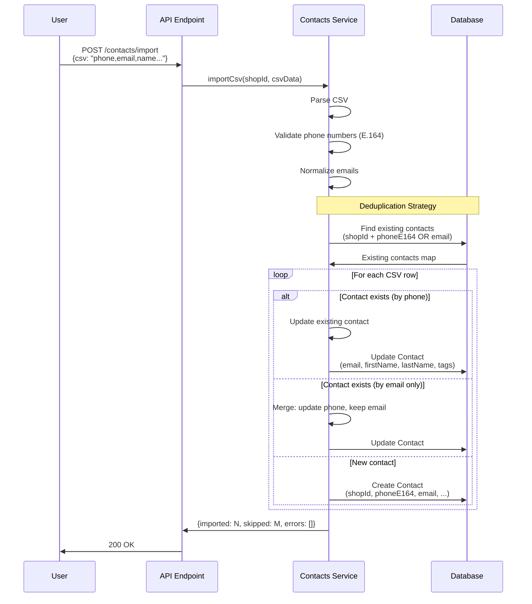
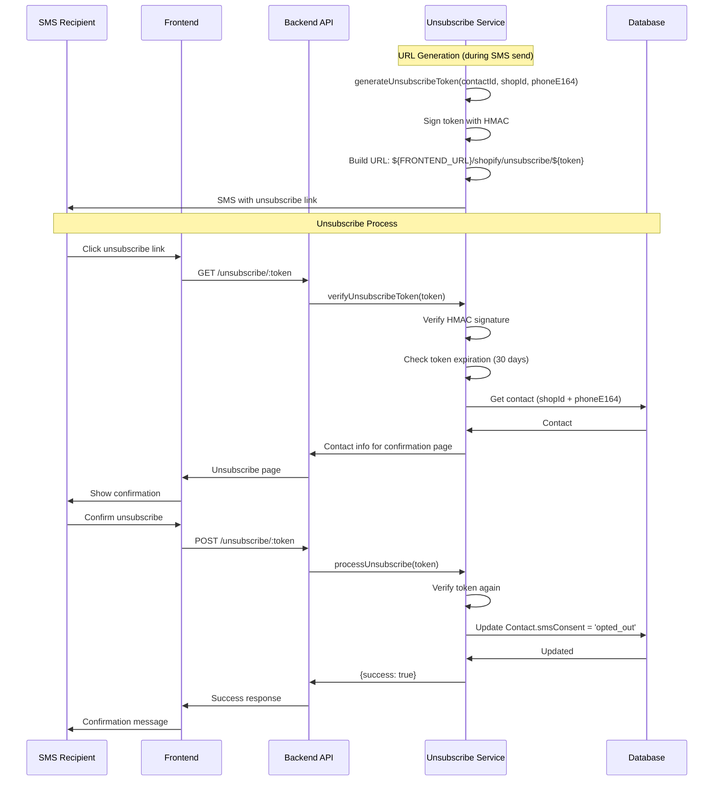
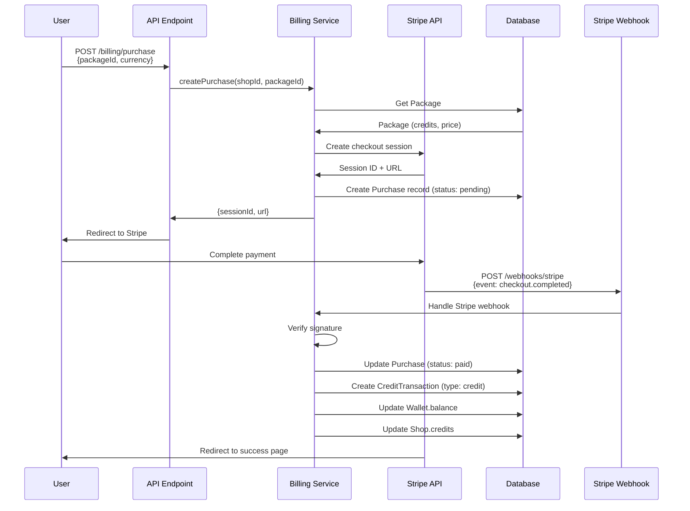
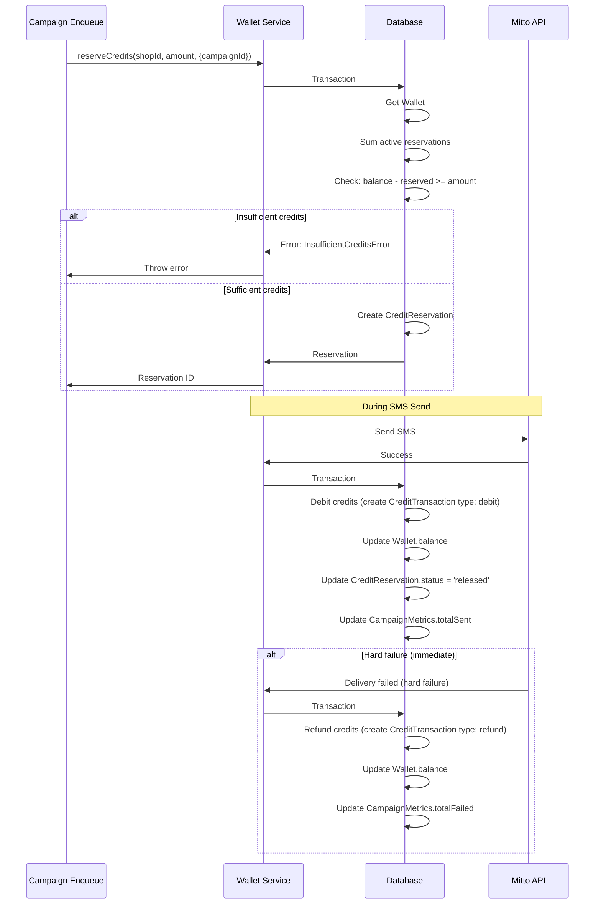
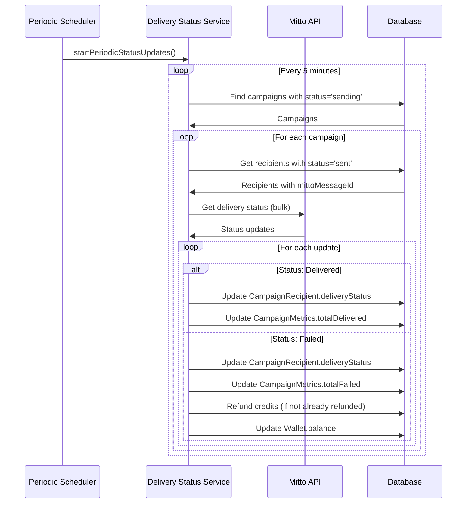
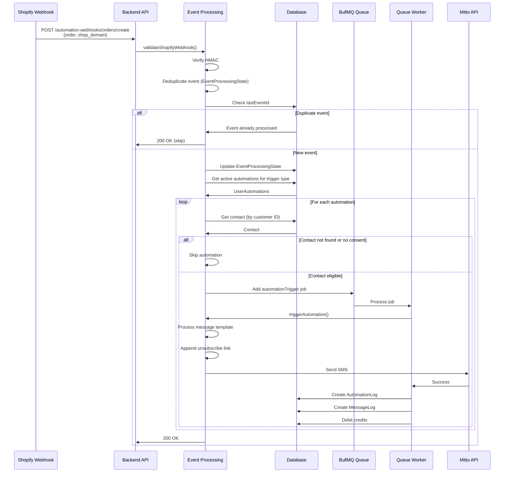

# Data Flow Diagrams

**Generated**: 2025-01-XX  
**Purpose**: Step-by-step data flow diagrams for critical system operations

## 1. Authentication & Session Flow

### Shopify Extension (App Bridge)

### Web App (OAuth Flow)

## 2. Campaign Creation → Enqueue → Send Flow

### Critical Transaction Boundaries

1. **Credit Reservation**: Must be atomic with balance check
2. **Status Update + Recipient Creation**: Must be atomic to prevent orphaned recipients
3. **Credit Debit**: Must be atomic with message send to prevent double-charging

## 3. Contacts Import & Deduplication Flow

### Deduplication Rules

1. **Primary Key**: `(shopId, phoneE164)` - unique constraint
2. **Secondary Key**: `(shopId, email)` - unique constraint
3. **Merge Strategy**: 
   - If phone matches → update all fields
   - If email matches but phone differs → update phone (phone is primary)
   - If neither matches → create new contact

## 4. Unsubscribe/Opt-Out Flow

### Security Measures

1. **Token Signing**: HMAC-SHA256 with secret key
2. **Token Expiration**: 30 days
3. **Verification**: Token verified on both GET and POST
4. **No Authentication Required**: Public endpoint (token is the auth)

## 5. Billing/Credits Flow

### Credit Purchase Flow

### Credit Reservation → Debit → Refund Flow

### Credit Reconciliation

## 6. Automation Trigger Flow

## 7. Points Where System Can Double-Send or Get Stuck

### Risk 1: Campaign Double-Enqueue

**Scenario**: User clicks "Send" button twice quickly

**Current Protection**:
- Status check: Campaign must be `draft` or `scheduled` to enqueue
- Status update to `sending` is atomic
- If status is already `sending`, enqueue returns early

**Gap**: Race condition if two requests hit simultaneously before status update

**Recommendation**: Add database-level unique constraint or use advisory locks

### Risk 2: Campaign Stuck in "Sending" Status

**Scenario**: Queue worker crashes mid-send, campaign never completes

**Current Protection**:
- Periodic status updates check `sending` campaigns
- Reconciliation updates metrics based on actual delivery status

**Gap**: Campaign status never transitions to `sent` if all recipients processed but status not updated

**Recommendation**: Add reconciliation job that checks if all recipients processed and updates status

### Risk 3: Credit Double-Debit

**Scenario**: Worker processes same job twice (retry after partial failure)

**Current Protection**:
- Credit debit happens after successful Mitto API call
- CampaignRecipient status prevents duplicate sends (unique constraint on `(campaignId, phoneE164)`)

**Gap**: If job retries after partial batch send, credits may be debited twice

**Recommendation**: Idempotency keys for credit transactions, check before debit

### Risk 4: Automation Double-Trigger

**Scenario**: Same Shopify event processed twice

**Current Protection**:
- `EventProcessingState` table tracks last processed event ID
- Deduplication check before processing

**Gap**: Race condition if two webhooks arrive simultaneously

**Recommendation**: Database unique constraint on `(shopId, automationType, lastEventId)` or use advisory locks

## 8. Idempotency Strategy

### Campaign Enqueue
- **Idempotency Key**: `campaign-${campaignId}-enqueue-${timestamp}`
- **Check**: Campaign status must be `draft` or `scheduled`
- **Result**: If already `sending`, return existing job count

### SMS Send
- **Idempotency Key**: `sms-${campaignId}-${phoneE164}`
- **Check**: CampaignRecipient unique constraint `(campaignId, phoneE164)`
- **Result**: If recipient exists, skip send

### Credit Transaction
- **Idempotency Key**: `credit-${shopId}-${campaignId}-${type}-${timestamp}`
- **Check**: None currently
- **Recommendation**: Add idempotency key to CreditTransaction meta field

### Webhook Processing
- **Idempotency Key**: `webhook-${shopId}-${eventId}`
- **Check**: EventProcessingState.lastEventId
- **Result**: Skip if event already processed

