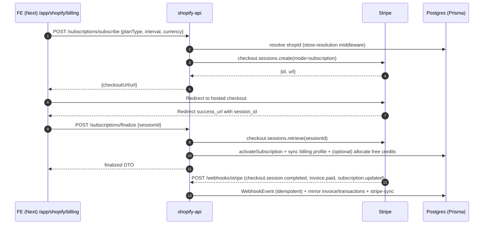
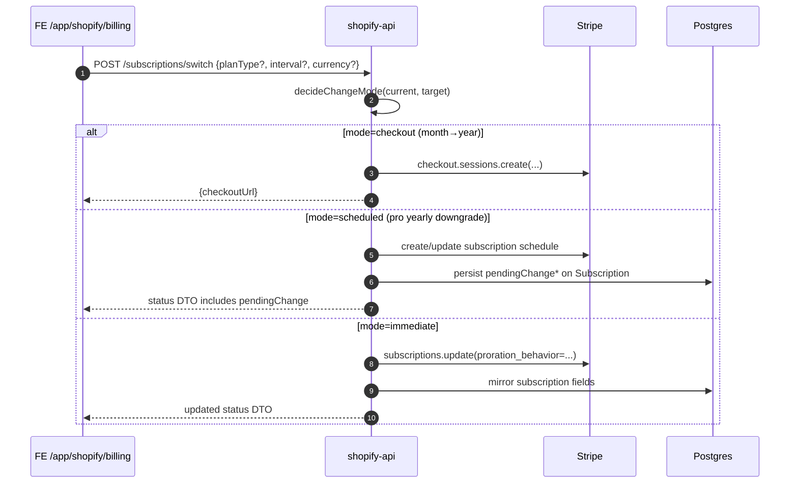
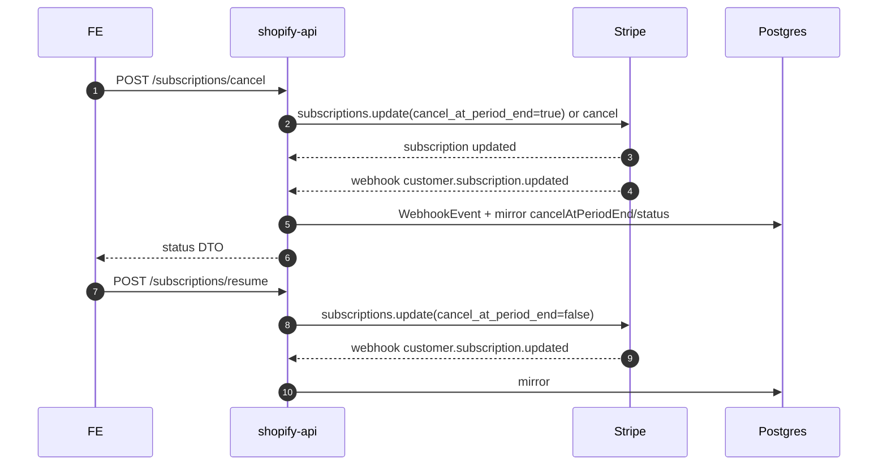
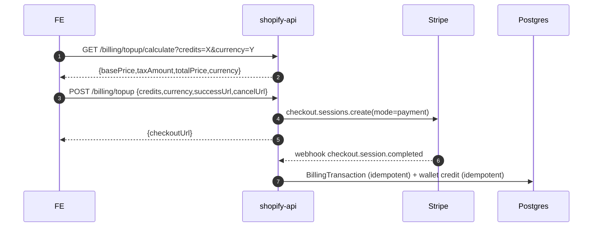
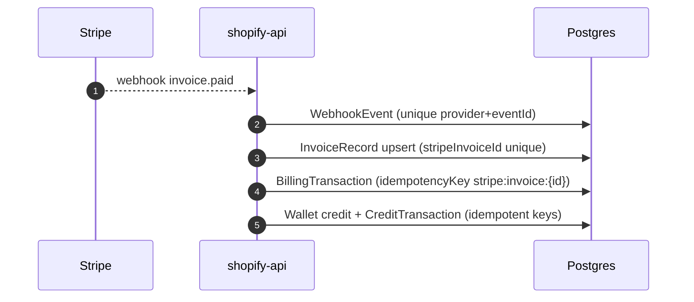
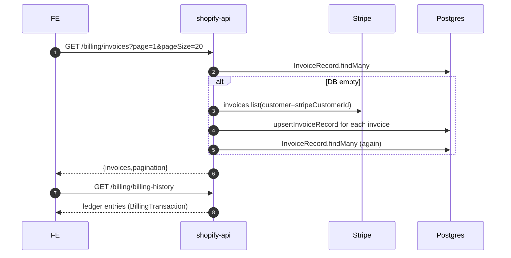
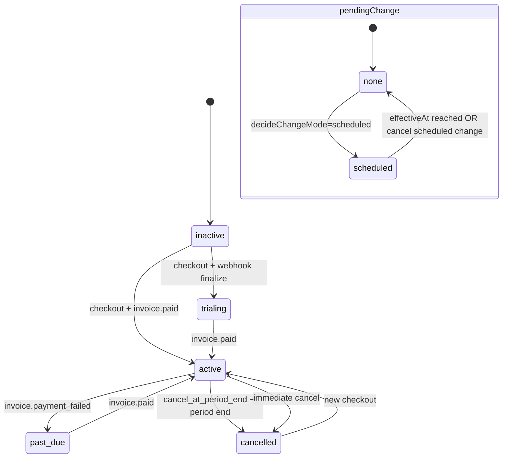
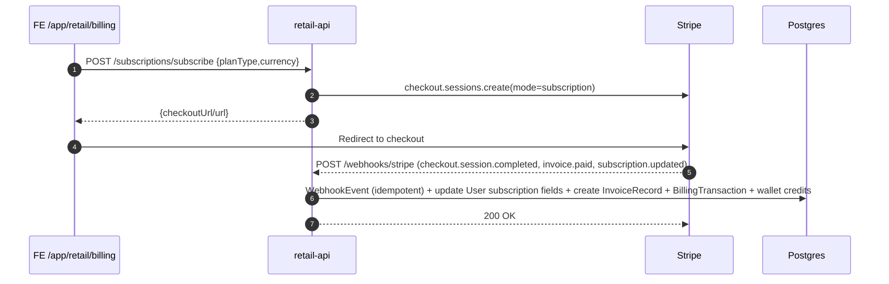
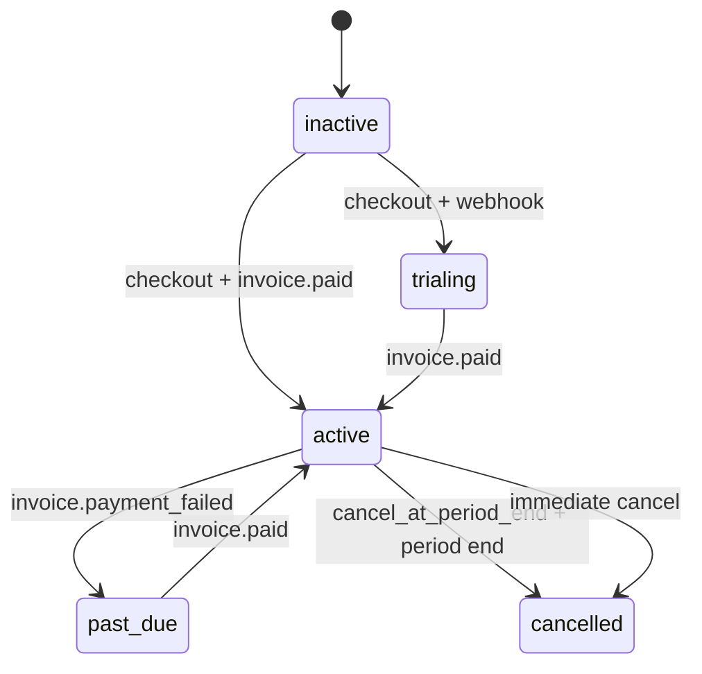

# Unified Billing Process + Stages Report (Retail + Shopify)

Repo: `astronote-shopify-backend`  
Scope scanned: `apps/shopify-api`, `apps/retail-api`, `apps/astronote-web/app/app/*/billing/*`  
Rule of engagement: **REPORT-ONLY** (no behavior changes), **NO COMMIT**

---

## 1) Executive Summary

### Shopify billing architecture summary
- **Tenant key**: `shopId` (Shopify shop)  
  - Backend resolves tenant context via `store-resolution` and `getStoreId(req)` (see `apps/shopify-api/controllers/billing.js`, `apps/shopify-api/controllers/subscriptions.js`).
- **Endpoints**:
  - Billing: `apps/shopify-api/routes/billing.js`
  - Subscriptions: `apps/shopify-api/routes/subscriptions.js`
  - Stripe webhooks: `apps/shopify-api/routes/stripe-webhooks.js` → `apps/shopify-api/controllers/stripe-webhooks.js`
- **Stripe “truth” model**:
  - Stripe is **source of truth** for subscription lifecycle + invoice/payment events.
  - DB is a mirror/cache for: subscription snapshot, invoices, billing transactions (purchase history), wallet/credits ledger, and webhook audit/idempotency.
- **Recovery/guarantees**:
  - **Stripe ↔ DB transparency** on reads through `StripeSyncService`: `apps/shopify-api/services/stripe-sync.js`.
  - **DB-first with Stripe fallback** for invoices: `apps/shopify-api/services/invoices.js` (`listInvoices()` fetches from Stripe if DB empty).
  - **Webhook replay protection** enforced via `apps/shopify-api/services/webhook-replay.js` and `WebhookEvent` Prisma uniqueness.

### Retail billing architecture summary
- **Tenant key**: `ownerId` (Retail user/store account)  
  - Backend scopes billing to `req.user.id` via `requireAuth`: `apps/retail-api/apps/api/src/routes/billing.js`.
- **Endpoints**:
  - Billing + subscriptions: `apps/retail-api/apps/api/src/routes/billing.js`
  - Stripe webhooks: `apps/retail-api/apps/api/src/routes/stripe.webhooks.js`
- **Stripe “truth” model**:
  - Stripe is **source of truth** for subscription + invoice/payment events.
  - DB is mirror/cache for: subscription snapshot, invoices, billing transactions, wallet/credits ledger, webhook audit/idempotency.
- **Recovery/guarantees**:
  - Stripe webhook replay protection: `apps/retail-api/apps/api/src/services/webhook-replay.service.js` (backed by `WebhookEvent` unique constraint).
  - **No Stripe fallback** in Retail invoices service (DB-only): `apps/retail-api/apps/api/src/services/invoices.service.js` (risk: invoices can appear empty even if Stripe has data).

### Source of truth: Stripe vs DB (by artifact)

| Artifact | Shopify source of truth | Retail source of truth | DB mirror? | Notes / paths |
|---|---|---|---|---|
| Subscription status, period dates | Stripe | Stripe | Yes | Shopify: `services/stripe-sync.js`, `services/subscription.js`; Retail: `services/subscription.service.js` + webhook updates |
| Pending change / scheduled downgrade | Stripe (schedule) | **Not fully modeled** | Shopify yes | Shopify `Subscription.pendingChange*` in Prisma; Retail has no pendingChange fields in Prisma `Subscription` |
| Invoices list | Stripe | Stripe | Yes | Shopify: DB-first + Stripe fallback `services/invoices.js`; Retail: DB-only `services/invoices.service.js` |
| Purchase history / billing ledger | DB (idempotent mirror of Stripe events) | DB | Yes | Shopify: `BillingTransaction` unique `(shopId,idempotencyKey)`; Retail: `(ownerId,idempotencyKey)` |
| Credits / wallet balance | DB ledger | DB ledger | N/A | Shopify: `services/wallet.js`; Retail: `services/wallet.service.js` |
| Included credits per period | Stripe event triggers, DB ledger is truth | Stripe event triggers, DB ledger is truth | Yes | Shopify: invoice handlers in `controllers/stripe-webhooks.js` + `services/subscription.js`/`services/invoices.js`; Retail: `routes/stripe.webhooks.js` + `services/subscription.service.js` |
| Webhook idempotency | DB (`WebhookEvent`) | DB (`WebhookEvent`) | Yes | Shopify: `services/webhook-replay.js`; Retail: `services/webhook-replay.service.js` |

### Top 5 risks (highest-signal)
1. **Retail checkout success/cancel redirect mismatch**: Retail backend builds `successUrl` as `/billing/success` and `cancelUrl` as `/billing/cancel` (`apps/retail-api/apps/api/src/routes/billing.js`), but the Next app only contains Shopify success/cancel routes (`apps/astronote-web/app/app/shopify/billing/{success,cancel}/page.tsx`). No Retail equivalents were found under `apps/astronote-web/app/app/retail/billing/**`.  
2. **Retail invoices can be empty even if Stripe has invoices**: `apps/retail-api/apps/api/src/services/invoices.service.js` lists DB records only; no Stripe fallback/backfill exists (contrast with Shopify `apps/shopify-api/services/invoices.js`).  
3. **Plan/price env var catalog drift between products**:
   - Shopify uses a full plan catalog matrix (plan × interval × currency) in `apps/shopify-api/services/plan-catalog.js` + strict validation in `apps/shopify-api/config/env-validation.js`.
   - Retail uses simpler env naming (`STRIPE_PRICE_ID_SUB_{PLAN}_{CURRENCY}`) via `apps/retail-api/apps/api/src/billing/stripePrices.js` and embeds assumptions about plan interval (`starter=month`, `pro=year`) in `apps/retail-api/apps/api/src/services/subscription.service.js`.  
4. **Stripe SDK/API version drift**: Retail `apps/retail-api/apps/api/src/services/stripe.service.js` initializes Stripe with `apiVersion: '2024-12-18.acacia'`, while Shopify uses `'2024-06-20'` in several services/controllers (`apps/shopify-api/services/stripe.js`, `apps/shopify-api/controllers/stripe-webhooks.js`, etc.). This can cause subtle behavior differences across tenants/products.  
5. **Tenant mapping edge cases in webhook resolution**: both webhook handlers support metadata + customerId + subscriptionId resolution, but unmatched events are handled differently. Shopify explicitly records unmatched events and returns success (`apps/shopify-api/controllers/stripe-webhooks.js`); Retail resolves owner from multiple sources but correctness depends on metadata consistency (`apps/retail-api/apps/api/src/routes/stripe.webhooks.js`).  

---

## 2) Data Models (Authoritative from Prisma)

### Shopify (apps/shopify-api/prisma/schema.prisma)

#### Tenant model (shop)
- `Shop` is the tenant root with billing identifiers on the same record:
  - `Shop.stripeCustomerId` (unique)
  - `Shop.stripeSubscriptionId` (unique)
  - subscription status snapshot fields (interval, period dates, cancelAtPeriodEnd, allowance tracking)
  - See: `apps/shopify-api/prisma/schema.prisma` (`model Shop`)

#### Billing profile
- `ShopBillingProfile`:
  - `legalName`, `billingEmail`, `billingAddress` (Json)
  - VAT fields: `vatNumber`, `vatCountry`, and validation fields (`vatValidated`, `taxStatus`, `taxTreatment`, etc.)
  - See: `apps/shopify-api/prisma/schema.prisma` (`model ShopBillingProfile`)

#### Subscription snapshot + pending change tracking
- `Subscription` table:
  - Canonical fields: `planCode`, `interval`, `currency`, `status`, period dates, `cancelAtPeriodEnd`
  - Pending change fields: `pendingChangePlanCode`, `pendingChangeInterval`, `pendingChangeCurrency`, `pendingChangeEffectiveAt`
  - Reconciliation metadata: `lastSyncedAt`, `sourceOfTruth`
  - See: `apps/shopify-api/prisma/schema.prisma` (`model Subscription`)

#### Wallet / credits / ledger
- `Wallet` balance is the canonical credit balance (ledger-driven).
- `CreditTransaction`:
  - Unique constraint: `@@unique([shopId, idempotencyKey])` (prevents double credit/debit)
  - Links to wallet and optionally to campaign/message
- `BillingTransaction`:
  - Unique constraint: `@@unique([shopId, idempotencyKey])` (prevents double ledger entries from webhook replays)
  - Stripe IDs stored in `stripeSessionId` / `stripePaymentId`
  - See: `apps/shopify-api/prisma/schema.prisma` (`model Wallet`, `CreditTransaction`, `BillingTransaction`)

#### Invoice records
- `InvoiceRecord`:
  - `stripeInvoiceId` UNIQUE
  - URLs (`hostedInvoiceUrl`, `pdfUrl`), totals in cents, `issuedAt`
  - See: `apps/shopify-api/prisma/schema.prisma` (`model InvoiceRecord`)

#### Webhook idempotency / audit
- `WebhookEvent`:
  - `@@unique([provider, eventId])`
  - `shopId` optional, `payloadHash`, `eventType`, `status` fields
  - See: `apps/shopify-api/prisma/schema.prisma` (`model WebhookEvent`)

#### Migrations reality checks (Shopify)
Billing-related migrations are present under `apps/shopify-api/prisma/migrations/`, including:
- `20250206000000_add_subscription_interval_fields/migration.sql`
- `20250206000001_add_billing_profile_vat_fields/migration.sql`
- `20250127000000_add_billing_parity_fields/migration.sql`
- `20241220000000_add_subscriptions_and_credit_transactions/migration.sql`

### Retail (apps/retail-api/prisma/schema.prisma)

#### Tenant model (owner)
- `User.id` is the tenant root. Billing identifiers live directly on `User`:
  - `User.stripeCustomerId` (unique)
  - `User.stripeSubscriptionId` (unique)
  - `User.subscriptionStatus`, `User.subscriptionInterval`, `User.subscriptionCurrentPeriodStart/End`, etc.
  - See: `apps/retail-api/prisma/schema.prisma` (`model User`)

#### Billing profile
- `BillingProfile`:
  - VAT fields (`vatNumber`, `vatCountry`) and `billingAddress` json, currency enum (`BillingCurrency`)
  - See: `apps/retail-api/prisma/schema.prisma` (`model BillingProfile`)

#### Subscription snapshot
- `Subscription` table exists but is **simpler than Shopify**:
  - `planCode`, `status`, `currency`, period dates, `cancelAtPeriodEnd`
  - **No pending change fields** in Retail’s `Subscription`
  - See: `apps/retail-api/prisma/schema.prisma` (`model Subscription`)

#### Wallet / credits / ledger
- `Wallet` (ownerId unique), `CreditTransaction`, `BillingTransaction` with:
  - `BillingTransaction` unique: `@@unique([ownerId, idempotencyKey])`
  - Stripe session/payment IDs and creditsAdded
  - See: `apps/retail-api/prisma/schema.prisma`

#### Invoice records
- `InvoiceRecord`:
  - `stripeInvoiceId` UNIQUE
  - totals in cents; URLs for hosted/pdf
  - See: `apps/retail-api/prisma/schema.prisma` (`model InvoiceRecord`)

#### Webhook idempotency / audit
- `WebhookEvent`:
  - Required: `eventId` (string)
  - Unique constraint: `@@unique([provider, eventId])`
  - See: `apps/retail-api/prisma/schema.prisma` (`model WebhookEvent`)

#### Migrations reality checks (Retail)
Billing-related migrations are present under `apps/retail-api/prisma/migrations/`, including:
- `20250108153000_billing_schema_alignment/migration.sql`
- `20250109120000_add_billing_currency/migration.sql`
- `20250109143000_subscription_allowance/migration.sql`
- `20250205030000_retail_billing_parity/migration.sql`
- `20250915172419_add_webhook_event/migration.sql`
- `20250915204523_billing_wallet_packages/migration.sql`

---

## 3) End-to-End Flows (Diagrams)

### Shopify flows

#### Subscribe flow (checkout → success → webhook finalize → DB mirror)

Key paths:
- Subscribe endpoint wiring: `apps/shopify-api/routes/subscriptions.js` → `apps/shopify-api/controllers/subscriptions.js`
- Success route exists: `apps/astronote-web/app/app/shopify/billing/success/page.tsx`
- Webhooks: `apps/shopify-api/routes/stripe-webhooks.js` → `apps/shopify-api/controllers/stripe-webhooks.js`
- Replay protection: `apps/shopify-api/services/webhook-replay.js` + Prisma `WebhookEvent`

#### Switch plan / interval flow (upgrade immediate / downgrade scheduled)

Key paths:
- Policy: `apps/shopify-api/services/subscription-change-policy.js`
- Stripe↔DB correctness on reads: `apps/shopify-api/services/stripe-sync.js`

#### Cancel & resume flow

#### Credit top-up flow (one-off)

#### Included credits per period (invoice.paid)

#### Invoices & purchase history (DB-first + Stripe fallback)

#### Subscription state machine (Shopify)

### Retail flows

#### Subscribe flow (checkout → webhook → DB mirror)

**Important mismatch**: Retail backend constructs `successUrl=/billing/success` and `cancelUrl=/billing/cancel` (`apps/retail-api/apps/api/src/routes/billing.js`), but the Next app only has Shopify billing success/cancel routes (`apps/astronote-web/app/app/shopify/billing/...`). This is an end-to-end redirect risk (see findings).

#### Credit top-up flow (Retail)
- Retail has an explicit credit top-up priceId resolver (`STRIPE_PRICE_ID_CREDIT_TOPUP_{CURRENCY}`) in `apps/retail-api/apps/api/src/billing/stripePrices.js`, and a checkout creator in `apps/retail-api/apps/api/src/services/stripe.service.js` (`createCreditTopupCheckoutSession`).

#### Subscription state machine (Retail)

Retail does **not** have a modeled pendingChange state in Prisma `Subscription`.

---

## 4) API Endpoints Reference

### Shopify backend endpoints (apps/shopify-api)

#### Billing (`apps/shopify-api/routes/billing.js`)
- `GET /billing/balance` → credits + subscription snapshot
- `GET /billing/summary` → subscription + allowance + credits
- `GET /billing/profile`
- `PUT /billing/profile`
- `POST /billing/profile/sync-from-stripe`
- `GET /billing/packages` (only active subscription)
- `GET /billing/topup/calculate`
- `POST /billing/topup`
- `GET /billing/history`
- `GET /billing/billing-history`
- `GET /billing/invoices`
- `POST /billing/purchase`

#### Subscriptions (`apps/shopify-api/routes/subscriptions.js`)
- `GET /subscriptions/status`
- `POST /subscriptions/reconcile`
- `POST /subscriptions/subscribe`
- `POST /subscriptions/update`
- `POST /subscriptions/scheduled/change`
- `POST /subscriptions/scheduled/cancel`
- `POST /subscriptions/switch`
- `POST /subscriptions/cancel`
- `POST /subscriptions/resume`
- `POST /subscriptions/verify-session`
- `GET /subscriptions/portal`
- `POST /subscriptions/finalize`

#### Stripe webhooks (`apps/shopify-api/routes/stripe-webhooks.js`)
- `POST /webhooks/stripe` (mounted at `/` inside router; actual mount point in app server)
- Handled event types include (as implemented in `apps/shopify-api/controllers/stripe-webhooks.js`):
  - `checkout.session.completed`, `checkout.session.expired`
  - `payment_intent.succeeded`, `payment_intent.payment_failed`
  - `invoice.payment_succeeded` / `invoice.paid`
  - `invoice.payment_failed`
  - `customer.subscription.updated`, `customer.subscription.deleted`
  - `charge.refunded` / `payment_intent.refunded`

Tenant/auth notes:
- API endpoints require a resolved `shopId` (see controller usage of `getStoreId(req)`).
- Webhooks are unauthenticated but resolve shopId from metadata/customer/subscription lookup (`apps/shopify-api/controllers/stripe-webhooks.js`).

### Retail backend endpoints (apps/retail-api)

#### Billing + subscriptions (`apps/retail-api/apps/api/src/routes/billing.js`)
- `GET /billing/balance` (+ `GET /billing/wallet` alias)
- `GET /billing/summary`
- `GET /billing/profile`
- `PUT /billing/profile`
- `GET /billing/invoices`
- `GET /billing/transactions`
- `GET /billing/packages`
- `GET /billing/purchases`
- `POST /billing/purchase`
- `GET /subscriptions/current`
- `POST /subscriptions/reconcile`
- `POST /subscriptions/subscribe`
- `POST /subscriptions/switch`
- `POST /subscriptions/cancel`
- `GET /subscriptions/portal`

#### Stripe webhooks (`apps/retail-api/apps/api/src/routes/stripe.webhooks.js`)
- `POST /webhooks/stripe`
- Uses replay protection: `processWebhookWithReplayProtection` (`apps/retail-api/apps/api/src/services/webhook-replay.service.js`)

Tenant/auth notes:
- Retail endpoints are `requireAuth` and scope by `req.user.id` (ownerId).
- Webhooks infer ownerId via metadata/customerId/subscriptionId lookups (`resolveOwnerIdFromStripeEvent` in `apps/retail-api/apps/api/src/routes/stripe.webhooks.js`).

---

## 5) Stripe Configuration & Environment Variables Audit

### Shopify (apps/shopify-api)

#### Core Stripe env vars
- `STRIPE_SECRET_KEY` (required in prod per `apps/shopify-api/config/env-validation.js`)
- `STRIPE_WEBHOOK_SECRET` (optional-but-required for real webhooks)
- `STRIPE_TAX_ENABLED` (feature flag used by Stripe integration services)
- Frontend URL used for redirects:
  - `FRONTEND_URL` (or `FRONTEND_BASE_URL` / `WEB_APP_URL`) validated by `apps/shopify-api/config/env-validation.js`

#### Plan catalog env vars (planType × interval × currency)
Authoritative mapping: `apps/shopify-api/services/plan-catalog.js`:
- `starter/month/EUR` → `STRIPE_PRICE_ID_SUB_STARTER_MONTH_EUR`
- `starter/month/USD` → `STRIPE_PRICE_ID_SUB_STARTER_MONTH_USD`
- `starter/year/EUR` → `STRIPE_PRICE_ID_SUB_STARTER_YEAR_EUR`
- `starter/year/USD` → `STRIPE_PRICE_ID_SUB_STARTER_YEAR_USD`
- `pro/month/EUR` → `STRIPE_PRICE_ID_SUB_PRO_MONTH_EUR`
- `pro/month/USD` → `STRIPE_PRICE_ID_SUB_PRO_MONTH_USD`
- `pro/year/EUR` → `STRIPE_PRICE_ID_SUB_PRO_YEAR_EUR`
- `pro/year/USD` → `STRIPE_PRICE_ID_SUB_PRO_YEAR_USD`

Legacy fallback env vars exist (documented in `plan-catalog.js`) but are intended as backward compatibility only.

#### Checkout URL correctness
- Shopify subscribe explicitly builds:
  - success URL: `/app/shopify/billing/success?session_id={CHECKOUT_SESSION_ID}&type=subscription`
  - cancel URL: `/app/shopify/billing/cancel`
  - Implementation: `apps/shopify-api/controllers/subscriptions.js`
- Frontend routes exist:
  - `apps/astronote-web/app/app/shopify/billing/success/page.tsx`
  - `apps/astronote-web/app/app/shopify/billing/cancel/page.tsx`

### Retail (apps/retail-api)

#### Core Stripe env vars
- `STRIPE_SECRET_KEY` (required to enable Stripe features; service logs warning if missing)
- `STRIPE_WEBHOOK_SECRET`
- `STRIPE_TAX_ENABLED`
- Frontend base URL used for redirects: via `buildRetailFrontendUrl()` (`apps/retail-api/apps/api/src/lib/frontendUrl.js`, referenced by `apps/retail-api/apps/api/src/routes/billing.js`).

#### Price env vars (Retail)
Retail’s authoritative env var naming differs from Shopify’s plan catalog:
- Subscription:
  - `STRIPE_PRICE_ID_SUB_STARTER_EUR`, `STRIPE_PRICE_ID_SUB_STARTER_USD`
  - `STRIPE_PRICE_ID_SUB_PRO_EUR`, `STRIPE_PRICE_ID_SUB_PRO_USD`
  - Resolver: `apps/retail-api/apps/api/src/billing/stripePrices.js`
- Credit top-up:
  - `STRIPE_PRICE_ID_CREDIT_TOPUP_EUR`, `STRIPE_PRICE_ID_CREDIT_TOPUP_USD`
  - Resolver: `apps/retail-api/apps/api/src/billing/stripePrices.js`
- Credit packs:
  - Prefer Package DB fields `stripePriceIdEur` / `stripePriceIdUsd`; fallback to env vars `STRIPE_PRICE_ID_{PACKAGE_NAME}_{CURRENCY}` and `STRIPE_PRICE_ID_{CURRENCY}`
  - Resolver: `apps/retail-api/apps/api/src/billing/stripePrices.js`

#### Checkout URL correctness (risk)
- Retail backend builds:
  - success URL: `/billing/success?session_id={CHECKOUT_SESSION_ID}`
  - cancel URL: `/billing/cancel`
  - Implementation: `apps/retail-api/apps/api/src/routes/billing.js`
- Next app **does not contain** Retail billing success/cancel pages under `apps/astronote-web/app/app/retail/billing/**`.

---

## 6) Webhook Processing & Idempotency

### Shopify
- Webhook handler: `apps/shopify-api/controllers/stripe-webhooks.js`
- Idempotency:
  - `WebhookEvent` unique `(provider,eventId)` (`apps/shopify-api/prisma/schema.prisma`)
  - Replay wrapper: `apps/shopify-api/services/webhook-replay.js` (`processWebhookWithReplayProtection`)
- Unmatched handling:
  - When shopId cannot be resolved, handler records an unmatched WebhookEvent and returns success (prevents retries).

### Retail
- Webhook handler: `apps/retail-api/apps/api/src/routes/stripe.webhooks.js`
- Idempotency:
  - `WebhookEvent` unique `(provider,eventId)` (`apps/retail-api/prisma/schema.prisma`)
  - Replay wrapper: `apps/retail-api/apps/api/src/services/webhook-replay.service.js`
- Unmatched handling:
  - Owner resolution tries metadata/customer/subscription; unmatched behavior depends on which handler path is triggered.

---

## 7) Transparency & Sync Guarantees (Stripe ↔ DB)

### Shopify
**Strongest guarantee in the repo**: `apps/shopify-api/services/stripe-sync.js`:
- Fetches Stripe subscription and derives canonical fields via plan catalog reverse lookup (`resolvePlanFromPriceId`).
- Updates DB (Shop + Subscription model) when mismatch detected.
- Tracks `sourceOfTruth` and `lastSyncedAt`.

Empty invoices/history scenarios (Shopify):
- Stripe customer mapping missing (no `stripeCustomerId`, requires resolution from subscription).
- Webhooks missed but invoices endpoint can self-heal via Stripe fallback (`apps/shopify-api/services/invoices.js`).

### Retail
Guarantees are weaker vs Shopify:
- Subscription status is stored on `User` and updated via webhooks and reconcile flows (`apps/retail-api/apps/api/src/services/subscription.service.js` and `apps/retail-api/apps/api/src/routes/stripe.webhooks.js`).
- Invoices endpoint is DB-only (`apps/retail-api/apps/api/src/services/invoices.service.js`), so missed webhooks can leave UI empty even if Stripe has invoices.

---

## 8) Frontend UX/UI & Contract Integrity

### Shopify billing UI (Next)
- Main page: `apps/astronote-web/app/app/shopify/billing/page.tsx`
  - Uses React Query hooks in `apps/astronote-web/src/features/shopify/billing/hooks/*`
  - Uses a backend-driven “allowed actions” model but still derives UI state for presentation:
    - UI action matrix: `apps/astronote-web/src/features/shopify/billing/utils/billingActionMatrix.ts`
- Success + cancel routes exist:
  - `apps/astronote-web/app/app/shopify/billing/success/page.tsx`
  - `apps/astronote-web/app/app/shopify/billing/cancel/page.tsx`
  - Success page validates `session_id` and calls finalize mutation for subscription only.

### Retail billing UI (Next)
- Main page: `apps/astronote-web/app/app/retail/billing/page.tsx`
  - Uses `billingApi` and `subscriptionsApi` clients:
    - `apps/astronote-web/src/lib/retail/api/billing.ts`
    - `apps/astronote-web/src/lib/retail/api/subscriptions.ts`
  - Creates idempotency keys client-side for switch/cancel (sends `Idempotency-Key` header).

Contract integrity notes:
- Retail FE expects subscription interval and allowance fields; backend provides these in `/billing/summary` and `/billing/balance`.
- Retail FE has no explicit success/cancel pages for Stripe checkout return; this is a likely broken UX path depending on how Stripe redirect is configured.

---

## 9) Findings & Action Plan

### MUST FIX (money / integrity / tenant safety)
1. **Retail redirect routes missing for Stripe checkout**
   - **Paths**: `apps/retail-api/apps/api/src/routes/billing.js` (builds `/billing/success`, `/billing/cancel`), Next app lacks `apps/astronote-web/app/app/retail/billing/{success,cancel}`.
   - **Fix**: add retail equivalents or change success/cancel to existing pages (requires product change; not done in this report task).
   - **Tests**: e2e-ish route existence check + unit test for URL builder.
   - **Verify**: create subscription checkout and ensure Stripe redirect lands on a valid Next route.

2. **Retail invoices lack Stripe fallback/backfill**
   - **Paths**: `apps/retail-api/apps/api/src/services/invoices.service.js` (DB-only), compare `apps/shopify-api/services/invoices.js` (fallback).
   - **Fix**: implement DB-first + Stripe fallback (idempotent upserts).
   - **Tests**: unit test where DB empty and Stripe list returns invoices → records created.
   - **Verify**: with Stripe invoices present, `/billing/invoices` returns non-empty.

3. **Standardize plan catalog semantics**
   - **Paths**:
     - Shopify: `apps/shopify-api/services/plan-catalog.js`, `apps/shopify-api/config/env-validation.js`
     - Retail: `apps/retail-api/apps/api/src/billing/stripePrices.js`, `apps/retail-api/apps/api/src/services/subscription.service.js`
   - **Fix**: converge to a shared plan catalog model (or generate one) across products; eliminate legacy assumptions where possible.
   - **Tests**: contract parity tests for (plan, interval, currency) support.

### SHOULD FIX (professionalism / correctness)
4. **Stripe SDK API version drift**
   - **Paths**: Retail `apps/retail-api/apps/api/src/services/stripe.service.js` vs Shopify `apps/shopify-api/services/stripe.js` and controllers.
   - **Fix**: standardize Stripe API version across services/apps.
   - **Verify**: run smoke flows in both products and compare Stripe object shapes/fields used.

5. **Retail subscription change policy parity**
   - **Paths**: Shopify `apps/shopify-api/services/subscription-change-policy.js` vs Retail subscription logic in `apps/retail-api/apps/api/src/services/subscription.service.js`.
   - **Fix**: implement explicit change policy & (if needed) pending change modeling in Retail for clarity.

### NICE TO HAVE (admin readiness / resilience)
6. **Parity scripts in gates**
   - Add optional scripts (below) to enforce env/catalog and FE/backend contract parity.
7. **Unified “billing summary DTO”**
   - Unify field naming across `/billing/summary` responses so FE can share components.

---

## 10) Appendix

### Key files scanned

#### Shopify backend
- `apps/shopify-api/prisma/schema.prisma`
- `apps/shopify-api/routes/billing.js`
- `apps/shopify-api/routes/subscriptions.js`
- `apps/shopify-api/routes/stripe-webhooks.js`
- `apps/shopify-api/controllers/billing.js`
- `apps/shopify-api/controllers/subscriptions.js`
- `apps/shopify-api/controllers/stripe-webhooks.js`
- `apps/shopify-api/services/plan-catalog.js`
- `apps/shopify-api/services/stripe-sync.js`
- `apps/shopify-api/services/stripe.js`
- `apps/shopify-api/services/invoices.js`
- `apps/shopify-api/services/billing.js`
- `apps/shopify-api/services/wallet.js`
- `apps/shopify-api/services/webhook-replay.js`
- `apps/shopify-api/config/env-validation.js`

#### Retail backend
- `apps/retail-api/prisma/schema.prisma`
- `apps/retail-api/apps/api/src/routes/billing.js`
- `apps/retail-api/apps/api/src/routes/stripe.webhooks.js`
- `apps/retail-api/apps/api/src/services/stripe.service.js`
- `apps/retail-api/apps/api/src/services/subscription.service.js`
- `apps/retail-api/apps/api/src/services/invoices.service.js`
- `apps/retail-api/apps/api/src/services/wallet.service.js`
- `apps/retail-api/apps/api/src/services/billing-profile.service.js`
- `apps/retail-api/apps/api/src/services/webhook-replay.service.js`
- `apps/retail-api/apps/api/src/billing/stripePrices.js`

#### Frontend (Next)
- Shopify billing page: `apps/astronote-web/app/app/shopify/billing/page.tsx`
- Shopify billing success: `apps/astronote-web/app/app/shopify/billing/success/page.tsx`
- Shopify billing cancel: `apps/astronote-web/app/app/shopify/billing/cancel/page.tsx`
- Retail billing page: `apps/astronote-web/app/app/retail/billing/page.tsx`
- Shopify billing hooks: `apps/astronote-web/src/features/shopify/billing/hooks/*`
- Shopify billing action matrix: `apps/astronote-web/src/features/shopify/billing/utils/billingActionMatrix.ts`
- Retail billing/subscription clients: `apps/astronote-web/src/lib/retail/api/{billing.ts,subscriptions.ts}`

### Example payloads (redacted)
- Stripe webhook event ID: `evt_...` (used as WebhookEvent.eventId)
- Retail idempotency header: `Idempotency-Key: <uuid>`
- Shopify checkout success URL token: `session_id={CHECKOUT_SESSION_ID}`

### Production readiness checklist (commands + verification)
- Lints:
  - `npm -w @astronote/shopify-api run lint`
  - `npm -w @astronote/retail-api run lint`
  - `npm -w @astronote/web-next run lint`
- Manual verification:
  - Subscribe (Shopify): ensure Stripe redirects to `/app/shopify/billing/success` and finalize succeeds.
  - Subscribe (Retail): verify the Stripe success URL lands on an existing Next route (currently a likely failure).
  - Webhooks: replay same Stripe event twice → ensure no duplicate credits/transactions (WebhookEvent unique).
  - Invoices: create at least one invoice in Stripe → confirm invoices endpoint returns data (Shopify should self-heal; Retail may not).

